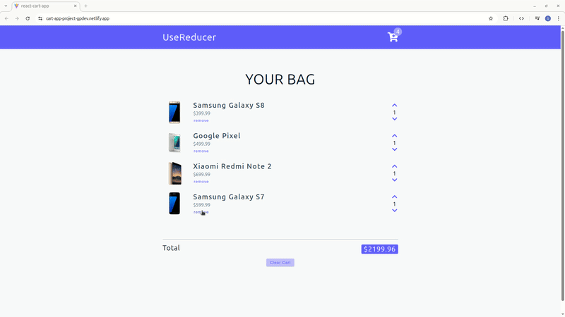
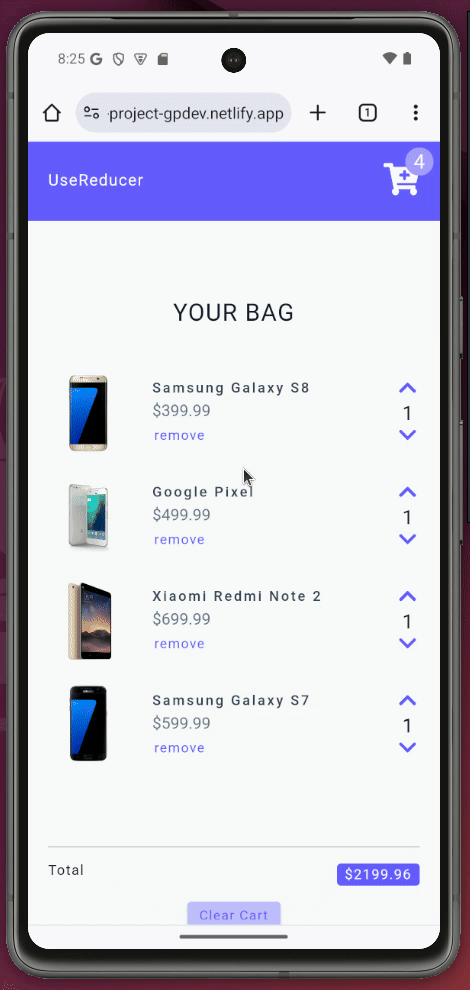

# React useReducer Cart 🛒⚡


A cart management system built with React's useReducer hook, focusing on advanced state management patterns and performance optimization. This project demonstrates how to handle complex state transitions in larger applications using modern React patterns.

## 🎯 Project Focus: State Management Logic

**Primary Learning Objective:** Learning how to use useReducer for complex state operations in scalable applications.

> **Note:** UI design provided by course instructor - implementation focused exclusively on state management logic and architecture.
> [View Figma Design](https://www.figma.com/file/5AwKjnWuM6BhRYmxdQFpky/Cart?node-id=0%3A1&t=lfaO4zazTd7nqF1q-1)

## 🚀 Live Demo

**View Live on Netlify:**  
[React useReducer Cart Demo](https://cart-app-project-gpdev.netlify.app/)

## 📸 Project Preview

<table align="center">
  <tr>
    <td align="center"><strong>🛒 Full Cart Functionality</strong></td>
  </tr>
  <tr>
    <td align="center"></td>
  </tr>
  
  <tr>
    <td align="center"><strong>📱 Responsive Design</strong></td>
  </tr>
  <tr>
    <td align="center"></td>
  </tr>
  <tr>
    <td align="center"><em>Fully functional cart with responsive design and real-time calculations</em></td>
  </tr>
</table>

## 🏗️ Architecture Highlights

### Advanced Data Structure Implementation

- **Map Data Structure**: Replaced traditional arrays with Map for O(1) lookups and updates
- **Key-Based Operations**: Efficient item management using unique IDs as keys
- **Immutability Patterns**: Proper state updates with new Map instances

### State Management Pattern

```javascript
// Action → Reducer → State Update Pattern
dispatch({ type: 'ACTION', payload: data })
  → reducer(state, action)
  → new State → UI Update
```

## ✨ Core Features

- 🔄 **useReducer State Management**-Complex state transitions with predictable updates
- 🗺️ **Map Data Structure**-High-performance cart operations with O(1) complexity
- 🌐 **API Integration**-Dynamic data fetching with loading states
- 📱 **Responsive Design** -Seamless transition between mobile and desktop views
- 🧮 **Real-time Calculations** - Automatic total amount and cost updates
- 🎯 **Context API** - Global state management across components

## 🛠️ Built With

| Tool / Library     | Purpose                         |
| ------------------ | ------------------------------- |
| ⚡ **Vite**        | Fast build tool & dev server    |
| ⚛️ **React 19**    | Component-based UI              |
| 🔄 **useReducer**  | Advanced state management       |
| 🎯 **Context API** | Global state provider           |
| 🗺️ **Map API**     | High-performance data structure |
| 📋 **React Icons** | Icon library for menu items     |
| 🌐 **Fetch API**   | Data fetching from external API |

## 🎓 Key Learning Outcomes

### Advanced State Management

- **useReducer Implementation**- Handling complex state logic beyond useState
- **Context API Integration**- Global state management across components
- **Custom Hook Creation** - Reusable state logic with `useGlobalContext`

### Performance Optimization

- **Map vs Array**-O(1) operations vs O(n) for frequent updates
- **Efficient Rendering**-Components update only when relevant state changes
- **Memoized Calculations**-Totals computed from current state

### Data Structure Decisions

- **Map Benefits**- Faster lookups, built-in iteration methods, key-based access
- **When to Use Map**- Frequent updates, large datasets, key-based operations
- **Conversion Patterns** - `Array.from(map.entries())` for rendering

## 🏗️ Project Structure

```text
src/
├── components/          # UI Components
│   ├── CartContainer.jsx  # Main cart layout
│   ├── CartItem.jsx       # Individual cart item
│   └── Navbar.jsx         # Navigation with cart count
├── contexts/           # State Management
│   ├── AppContext.js      # React context creation
│   ├── AppProvider.jsx    # Global state provider
│   ├── reducer.js         # Core state logic
│   └── actions.js         # Action definitions
├── hooks/              # Custom Hooks
│   └── useGlobalContext.js # Context consumption
├── utils/              # Business Logic
│   └── getTotals.js       # Cart calculations
└── data.js             # Initial mock data
```

## 🔧 Technical Implementation

### Reducer Pattern

```javascript
const reducer = (state, action) => {
  if (action.type === "INCREASE") {
    const newCart = new Map(state.cart);
    const item = newCart.get(action.payload.id);
    const newItem = { ...item, amount: item.amount + 1 };
    newCart.set(action.payload.id, newItem);
    return { ...state, cart: newCart };
  }
  // ... other actions
};
```

### Performance Comparison

| Operation   | Array | Map  |
| ----------- | ----- | ---- |
| Find item   | O(n)  | O(1) |
| Update Item | O(n)  | O(1) |
| Delete Item | O(n)  | O(1) |
| Clear All   | O(1)  | O(1) |

### Cart Operations

- **Add/Remove Items** - Efficient Map operations
- **Quantity Management** - Increase/decrease with boundary checks
- **Total Calculations**- Real-time amount and cost updates
- **API Integration** - Dynamic data loading with state management

## 🚀 Getting Started

### Prerequisites

- **Node.js** ≥ 18.0.0
- **npm** or **yarn** package manager

### Installation

1. Clone the repository

```bash
git clone https://github.com/pro804/React-Cart-App.git
```

2. Navigate to the project directory

```bash
cd React-Cart-App
```

3. Install dependencies

```bash
npm install
```

4. Start the development server

```bash
npm run dev
```

5. Open http://localhost:5173 to view it in the browser.

## 🔧 Available Scripts

- `npm run dev` — Runs the development server (Vite)
- `npm run build` — Builds the app for production
- `npm run preview` — Previews the production build locally

## 📄 License

This project was created for educational purposes as part of a React learning journey.
This project is licensed under the MIT License.
See the [LICENSE](LICENSE) file for details.
